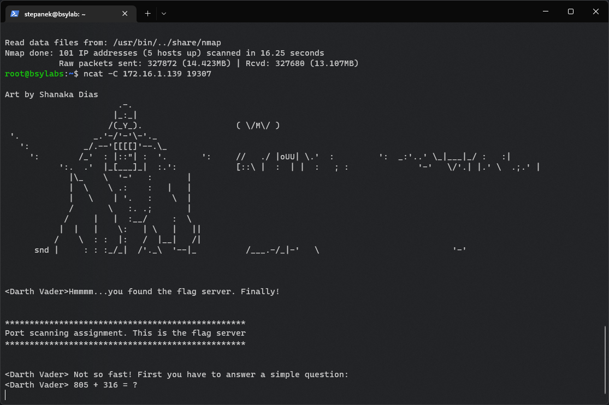

# Assignment 2

## ETag
We ran code scan for all TCP ports within the range given IP address range:

``nmap -sS -n -v 172.16.1.100-200 -p-``

This gave us this result

After failed attempts with ``ncat`` to the HTTP servers, which were baits, we tried

``ncat -C 172.16.1.139 19307``

where we knew we are at the righ place.

After simply math addition we got to the ETag.

## Highest TCP port number
We tried to run the scan for all running services over the TCP in the given the IP range with command. This approach is vulnerable to possibilitz that there is a HTTP server running over UDP.

``nmap -sV -n -v 172.16.1.100-200 -p-``

This told us that there is a HTTP server on the port 8080. We tried it and it worked.

## UDP services
